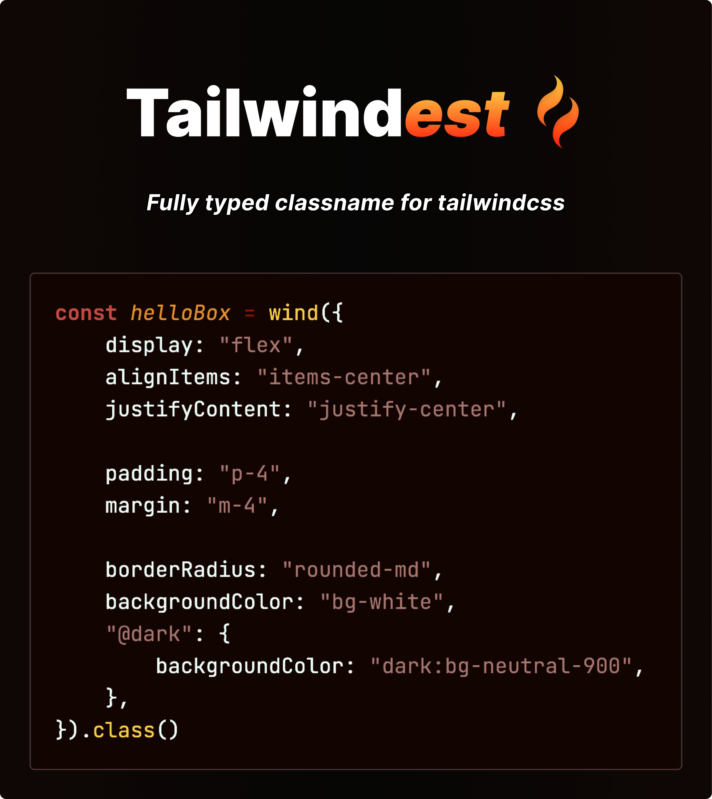

<br />

<div align="center">

</div>

<br />

## Write tailwind with confidence 🦾

1.  **Type-safe** `tailwind`
2.  Provide **full type definition** of `tailwind` properties
3.  **Solid conditional styling**, inspired by `cva`

## Useful features 🔮

-   Support **all JS-frameworks**
-   **Zero dependencies**
-   `768B`, **tiny bundle size**
-   **Support custom type**, defined in `tailwind.config.js`
-   `tailwind` **doc site link** embedded via `JSDoc`

## Start with docs 📖

**[Let's dive in 🏄‍♂️](https://tailwindest.vercel.app)**

<br />

## Overview 🚀

### 0. Install package

```bash
npm i tailwindest
```

### 1. Define styling tools

```ts
import { createTools, type Tailwindest } from "tailwindest"

// name it whatever you want
export const tw = createTools<Tailwindest>()
```

### 2. Use styling tools

#### A. Basic style

Define basic style sheet with `style`.

```tsx
const box = tw.style({
    display: "flex",
    alignItems: "items-center",
    justifyContent: "justify-center",

    paddingX: "px-[2.25px]",
    paddingY: "py-1",
    ":hover": {
        opacity: "hover:opacity-90",
    },
    "@sm": {
        paddingX: "sm:px-[4.5px]",
        paddingY: "sm:py-2",
    },
})

const Box = ({ children }) => <div className={box.class}>{children}</div>
```

#### B. Toggling

If you want to change the style based on a **single `boolean` condition**, use `toggle`.

```tsx
const themeBtn = tw.toggle({
    truthy: {}, // 🌝 light mode
    falsy: {}, // 🌚 dark mode
    base: {}, // [optional] base style
})

const ThemeBtn = ({ children }) => {
    const [isLight, setIsLight] = useState(false)

    return <button className={themeBtn.class(isLight)}>{children}</button>
}
```

#### C. Various conditions

If you need to change styles based on **three or more conditions within a single category**, use `rotary`.

```tsx
import { type GetVariants } from "tailwindest"

const btn = tw.rotary({
    default: {},
    success: {},
    warning: {},
    base: {}, // [optional] base style
})

interface BtnProps {
    onClick: () => void
    children: ReactNode
    type?: GetVariants<typeof btn>
}

const Btn = ({ onClick, children, type = "default" }: BtnProps) => (
    <button className={btn.class(type)} onClick={onClick}>
        {children}
    </button>
)
```

#### D. [Variants](https://stitches.dev/docs/variants)

```tsx
const btn = tw.variants({
    variants: {
        type: {
            default: {},
            success: {},
            warning: {},
        },
        size: {
            sm: {},
            md: {},
            lg: {},
        },
        border: {
            true: {},
            false: {},
        },
    },
    base: {}, // [optional] base style
})

interface BtnProps extends GetVariants<typeof btn> {
    onClick: () => void
    children: ReactNode
}

const Btn = ({
    children,
    size = "md",
    type = "default",
    border = true,
    onClick,
}: BtnProps) => (
    <button className={btn.class({ size, type, border })} onClick={onClick}>
        {children}
    </button>
)
```

#### E. Merging styles

Use `mergeProps` to **merge multiple styles** and **make prop-injectable universal components**.

```tsx
const text = tw.style({
    // text base style
})

interface TextProps {
    color?: Tailwindest["color"]
    fontWeight?: Tailwindest["fontWeight"]
}
export const UniversalText = ({
    children,
    ...textOptions
}: React.PropsWithChildren<TextProps>) => (
    <p
        className={tw.mergeProps(
            text.style,
            textOptions
            // override color and fontWeight
        )}
    >
        {children}
    </p>
)

const SomeComponent = () => (
    <>
        <UniversalText color="text-red-100" fontWeight="font-medium">
            color: red-100 & fontWeight: font-medium
        </UniversalText>

        <UniversalText color="text-blue-300" fontWeight="font-bold">
            color: blue-300 & fontWeight: font-bold
        </UniversalText>
    </>
)
```

<br />

## LICENSE 👻

<strong><p style="color:teal">MIT</p></strong>
