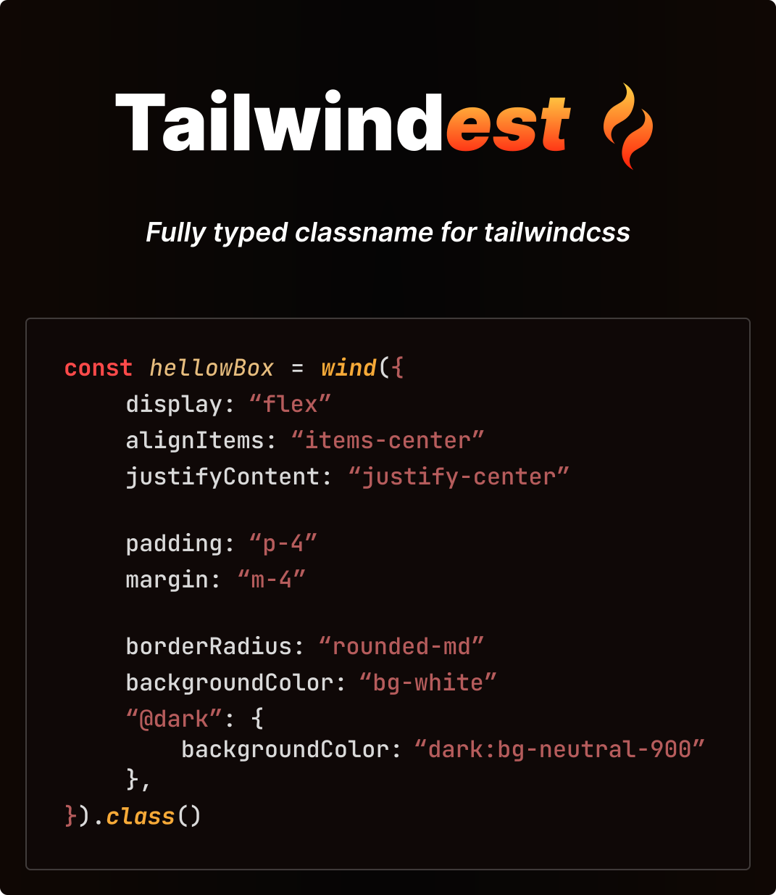
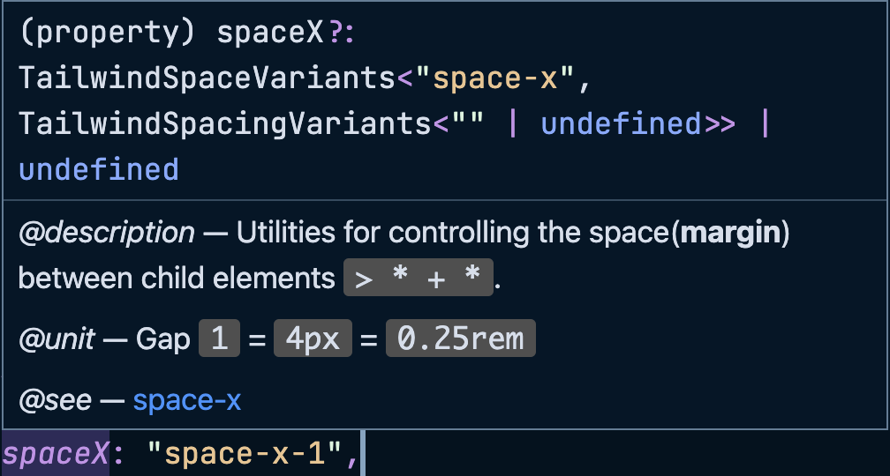

<br />

<div align="center">



</div>

<br />

# Design Goals

> **_Readable_** / **_Reusable_** / **_Flexible_**
>
> **_TypeSafe_** **`tailwind`**

<br />

# Recommended for

1. Wants fully **typed** **`tailwind`**
2. Build **design system with** **`tailwind`**
3. **CSS in TS like syntax** lover
4. **Typescript** lover
5. **Refactoring** lover

<br />

# Installation

```bash
pnpm i tailwindest
```

<br />

# Worth it?

## 🏛️ Fully typed

> **Autocompleted** by **`typescript`**
>
> **`tailwindcss`** is literally insane

## 💅 Similar to CSS in TS

> Syntax is **very similar to CSS in TS**, meaning **easy to start.**

## 🔮 Variants

> **Variants based conditional styling**, inspired by **`stitches`** & **`vanilla-extract`.**
>
> Practical and Intuitive.

## 🧬 Official Document

> **Hover** the property, you will **get document** **`link`.**
>
> 

## 🍦 Atomic Size

> Gzip, **`603B`** **_tiny_ library**.
>
> Don’t worry about bundle size.

## 🔌 Custom value? Yeas

> **Support extended custom values with generic**, defined in **`tailwind.config.js`**

```ts
type MyTailwind = Tailwindest<
    {
        color: "my-color-1" | "my-color-2" | "my-color-3"
        opacity: "15" | "25" | "35" | "45" | "55"
        sizing: "0.1" | "0.2" | "0.3" | "0.4" | "0.5"
        screens: {
            conditionA: "@iphone7"
            conditionB: "@ipad"
            conditionC: "@mac14"
            conditionD: "@mac16"
            conditionE: "@imac"
        }
    },
    {
        accentColor: "my-accent-1" | "my-accent-2"
        borderRadius: "my-rad-1" | "my-rad-2"
    }
>
```

## 🤯 Infinite Nest Break Condition

> Don't write **_repeated_ break conditions**.
>
> **Just _autocomplete_ it.**

```ts
const ohMyNest = wind({
    backgroundColor: "bg-red-800",
    ":hover": {
        backgroundColor: "hover:bg-red-700",
        borderColor: "hover:border-red-900",
        ":active": {
            backgroundColor: "hover:active:bg-red-500",
            borderColor: "hover:active:border-red-500",
            // nest never ends here 🤓...
            // next nest will be exclude ':hover' | ':active'
        },
    },

    "@dark": {
        backgroundColor: "dark:bg-red-100",
        borderColor: "dark:border-red-300",
        ":hover": {
            backgroundColor: "dark:hover:bg-red-200",
            borderColor: "dark:hover:border-red-400",
            ":active": {
                backgroundColor: "dark:hover:active:bg-red-500",
                borderColor: "dark:hover:active:border-red-500",
            },
            // nest never ends here too 🤯...
            // next nest will be exclude '@dark' | ':hover' | ':active'
        },
    },
})
```

> Do you still want normal `className`?

```ts
const ohMyClassName =
    "bg-red-800 hover:bg-red-700 hover:border-red-900 hover:active:bg-red-500 hover:active:border-red-500 dark:bg-red-100 dark:border-red-300 dark:hover:bg-red-200 dark:hover:border-red-400 dark:hover:active:bg-red-500 dark:hover:active:border-red-500"
```

> I don't want it.

## 🌈 Independency of platform

> `Tailwindest` is **just a string generator**.
>
> This means that it is **compatible with any library or framework**.
> Even _Vanilla JavaScript_ doesn't matter!

## 🔥 Combine Power of Inline & Tailwindest

> **Short / Simple style**
> = pure **`inline class`**
>
> **Complex / Conditional style**
> = **`tailwindest`**

<br />

# 📖 Recipe sugar book

1. `wind`

> **Define complex tailwind styles**

```ts
const box = wind({
    display: "flex",
    flexDirection: "flex-col",
    alignItems: "items-center",
    justifyContent: "justify-center",
}).class()

// ✅ flex flex-col items-center justify-center
```

<br />

2. `wind$`

> **Conditional styling with predefined variants**

```ts
const button = wind$("warning", "success")(
    {
        // default button styles
        backgroundColor: "bg-white",
        // ...def
    },
    {
        success: {
            backgroundColor: "bg-green-100",
            // ...def
        },
        warning: {
            backgroundColor: "bg-red-100",
            // ...def
        },
    }
)

// 🔥 variant name is fully autocompleted!
button.class("warning")
// ✅ bg-red-100
```

> Why should I have to predefine variants list?
>
> ✅ **more safer**
> ✅ **extract variants list into `array`**

<br />

3. `createVariants`

> Create complex variants based style
>
> Combination of `wind$`

**Ex) create `size`, `color` variants**

```ts
const btnSize = wind$(
    "sm",
    "md",
    "lg"
)(
    {
        // ...common style
    },
    {
        lg: {
            // ...lg style
        },
        md: {
            // ...md style
        },
        sm: {
            // ...sm style
        },
        default: "md",
    }
)
const btnColor = wind$("red", "blue")(
    {
        // ...common style
    },
    {
        red: {
            // ...red style
        },
        blue: {
            // ...blue style
        },
    }
)
```

**Define complex variants with `createVariants`**

```ts
const btn = createVariants({
    size: btnSize,
    color: btnColor,
})
```

**Use variants style**

```ts
const btnMdBlue = btn({
    size: "md",
    color: "blue",
})
```

<br />

4. `WindVariants`: `type`

> Get `variants type` at `wind$`, `createVariants`

-   `wind$`

    ```ts
    const button = wind$("default", "warning", "success")(/* ... */)

    type ButtonVariants = WindVariants<typeof button>

    // ✅ inferred result
    type ButtonVariants = "default" | "warning" | "success"
    ```

-   `createVariants`

    ```ts
    const buttonState = wind$("default", "warning", "success")(/* ... */)
    const buttonSize = wind$("sm", "md", "lg")(/* ... */)

    const button = createVariants({
        state: buttonState,
        size: buttonSize,
    })

    type ButtonVariants = WindVariants<typeof button>

    // ✅ inferred result
    type ButtonVariants = {
        state?: "default" | "warning" | "success" | undefined
        size?: "sm" | "md" | "lg" | undefined
    }
    ```

# Deep dive

[Read full api 🚀](./docs/api.md)
