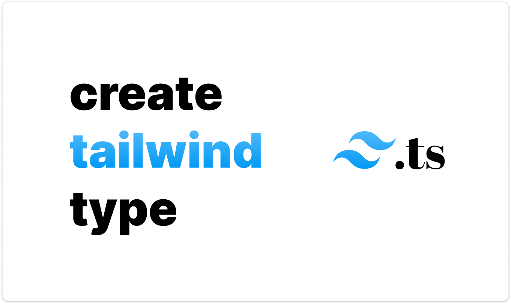

<br />

## Build type-safe tailwindcss product

<div align="center">

</div>

<br />

### 1. Create tailwind types

> [!NOTE]
>
> `create-tailwind-type` will generate type definitions for your tailwind configuration.

```bash
npx create-tailwind-type --base node_modules/tailwindcss --no-arbitrary-value --disable-variants
```

This command will generate `tailwind.ts` file in the root directory.

### 2. Install package

```bash
npm i tailwindest@latest
```

### 3. Create tools

```ts
import {
    createTools,
    type CreateTailwindest,
    type CreateTailwindLiteral,
} from "tailwindest"

import type { Tailwind, TailwindNestGroups } from "./tailwind"
import { twMerge } from "tailwind-merge"

export type Tailwindest = CreateTailwindest<{
    tailwind: Tailwind
    tailwindNestGroups: TailwindNestGroups
    groupPrefix: "$" // prefix for nest groups, [optional]
    useArbitrary: true // enable arbitrary values, [optional]
}>
export type TailwindLiteral = CreateTailwindLiteral<Tailwind>

export const tw = createTools<{
    tailwindest: Tailwindest
    tailwindLiteral: TailwindLiteral
    useArbitrary: true // enable arbitrary values, [optional]
}>({
    merger: twMerge, // set tailwind-merge as merger, [optional]
})
```

### 4. Use tools

#### Def - `tw.def(classList, ...styleList)`

```tsx
const condition: boolean = true

const container = tw.def(
    // 🚀 Powered by clsx
    [
        // ✅ Statically typed literals
        "flex",
        "size-fit",
        "flex-col",
        "items-center",
        "justify-center",
        "gap-y-12",

        // ✅ Arbitrary strings
        "md:flex-row md:gap-x-7",
        "lg:gap-x-24",

        // ✅ Conditional styling
        condition ? "p-3" : "p-1",

        // ✅ Array-based styling
        ["dark:text-white", "text-black"],
    ],

    // 🚀 Default merging behavior
    {
        // ✅ Record-based styling
        backgroundColor: "bg-white",
        dark: {
            backgroundColor: "dark:bg-black",
        },
    },
    {
        // ✅ Support for infinite record styling
        // Additional styles here...
    }
)

const Box = ({ children }) => <div className={container}>{children}</div>
```

#### Style - `tw.style(stylesheet)`

```tsx
const box = tw.style({
    display: "flex",
    alignItems: "items-center",
    justifyContent: "justify-center",
    padding: ["px-[2.25px]", "py-1"],
    $hover: {
        opacity: "hover:opacity-90",
    },
    $sm: {
        padding: ["sm:px-[4.5px]", "sm:py-2"],
    },
})

const Box = ({ children }) => {
    return <div className={box.class()}>{children}</div>
}

const Box2 = ({ children }) => {
    // pass arbitrary classnames
    return <div className={box.class("some-classnames")}>{children}</div>
}
```

#### Toggle - `tw.toggle({ truthy, falsy, base })`

If you want to change the style based on a **single `boolean` condition**, use `toggle`.

```tsx
const themeBtn = tw.toggle({
    truthy: {}, // › light mode
    falsy: {}, // › dark mode
    base: {}, // [optional] base style
})

const ThemeBtn = ({ children }) => {
    const [isLight, setIsLight] = useState(false)

    return <button className={themeBtn.class(isLight)}>{children}</button>
}
```

#### Rotary - `tw.rotary({ variants, base })`

If you need to change styles based on **three or more conditions within a single category**, use `rotary`.

```tsx
import { type GetVariants } from "tailwindest"

const btn = tw.rotary({
    variants: {
        success: {}, // › success
        warning: {}, // › warning
        error: {}, // › error
    },

    base: {}, // [optional] base style
})

interface BtnProps {
    onClick: () => void
    children: ReactNode
    type?: GetVariants<typeof btn>
}

const Btn = ({ onClick, children, type = "default" }: BtnProps) => (
    <button className={btn.class(type)} onClick={onClick}>
        {children}
    </button>
)
```

#### Variants - `tw.variants({ variants, base })`

```tsx
const btn = tw.variants({
    variants: {
        type: {
            default: {}, // › type.default
            success: {}, // › type.success
            warning: {}, // › type.warning
        },
        size: {
            sm: {}, // › size.sm
            md: {}, // › size.md
            lg: {}, // › size.lg
        },
        border: {
            sm: {}, // › border.sm
            md: {}, // › border.md
            lg: {}, // › border.lg
        },
    },
    base: {}, // [optional] base style
})

interface BtnProps extends GetVariants<typeof btn> {
    onClick: () => void
    children: ReactNode
}

const Btn = ({
    children,
    size = "md",
    border = "md",
    type = "default",
    onClick,
}: BtnProps) => (
    <button className={btn.class({ size, type, border })} onClick={onClick}>
        {children}
    </button>
)
```

---

## Create Tailwind Type

Generate typescript definitions for your tailwind configuration.

<div align="center">

</div>

```bash
npx create-tailwind-type
```

> [!IMPORTANT]  
> **Requires Tailwind CSS `v4.0.0` or higher.**

### Usage Examples

- **Use custom plugins**

**Should change base directory to `node_modules/tailwindcss`** for your own project.

```bash
npx create-tailwind-type -b node_modules/tailwindcss
```

- **Generate exact variants**

**Will generate exact variants instead of soft variants.** But slowdown typescript language server, if you use it directly. (Importing subtype will be fine.)

```bash
npx create-tailwind-type -S
```

- **Change output filename**

**Will generate types in `src/types/tailwind.d.ts` file.**

```bash
npx create-tailwind-type -f src/types/tailwind.d.ts
```

### CLI Options

> [!NOTE]
>
> Check out for more details about the CLI options in [this documentation](./packages/create-tailwind-type/README.md).

| Option (Short) | Option (Long)                 | Description                                                                                                                                                | Default Value          |
| -------------- | ----------------------------- | ---------------------------------------------------------------------------------------------------------------------------------------------------------- | ---------------------- |
| `-b`           | `--base <path>`               | Specifies the base directory for @tailwindcss/node package. If omitted, the tool automatically resolves to the installed `@tailwindcss` package directory. | _None_ (auto-resolved) |
| `-f`           | `--filename <filename>`       | Sets the output filename for the generated types.                                                                                                          | `tailwind.ts`          |
| `-d`           | `--docs`                      | Enables documentation comments in the generated types. Use the inverse flag to disable them.                                                               | `true`                 |
| `-D`           | `--no-docs`                   | Disables documentation comments in the generated types.                                                                                                    | N/A                    |
| `-a`           | `--arbitrary-value`           | Allows the generation of arbitrary values in the output types. Use the inverse flag to disable this feature.                                               | `true`                 |
| `-A`           | `--no-arbitrary-value`        | Disables arbitrary value generation.                                                                                                                       | N/A                    |
| `-s`           | `--soft-variants`             | Enables soft variant generation. When disabled (using the inverse flag), the tool will generate exact variants instead.                                    | `true`                 |
| `-S`           | `--no-soft-variants`          | Disables soft variant generation (resulting in exact variant generation).                                                                                  | N/A                    |
| `-k`           | `--string-kind-variants-only` | Limits the generated types to only string kind variants.                                                                                                   | `false`                |
| `-o`           | `--optional-property`         | Generates optional properties in the output types, which can be useful for partial configurations.                                                         | `false`                |
| `-N`           | `--disable-variants`          | Disable variant generation and types, can be increase performance.                                                                                         | `false`                |
| N/A            | `--version`                   | Displays the current CLI version.                                                                                                                          | N/A                    |
| N/A            | `--help`                      | Displays help and usage information for the CLI tool.                                                                                                      | N/A                    |
