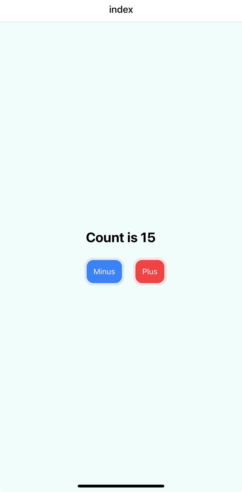

# Welcome to expo + tailwindest app example 👋

This is an [Expo](https://expo.dev) project created with [`create-expo-app`](https://www.npmjs.com/package/create-expo-app).

## 1. Setup

1. Install required deps for using `tailwindest` in expo
    ```bash
    npm i tailwindest
    ```
    ```bash
    npm i -D tailwindcss@3.3.2
    ```
2. Modify `babel.config.js` for using `nativewind`

    ```js
    module.exports = function (api) {
        api.cache(true)
        return {
            presets: ["babel-preset-expo"],
            plugins: ["nativewind/babel"],
        }
    }
    ```

3. Add `app.d.ts` for supporting `className` props

    ```ts
    /// <reference types="nativewind/types" />
    ```

4. Add `tailwind.config.js` for customizing tailwindcss

    ```js
    module.exports = {
        mode: "jit",
        purge: ["./app/**/*.{js,ts,jsx,tsx}"],
        darkMode: false, // or 'media' or 'class'
        theme: {
            extend: {},
        },
        variants: {
            extend: {},
        },
        plugins: [],
    }
    ```

5. Add `tw.ts` for using `tailwindest`

    ```ts
    import { createTools, type Tailwindest } from "tailwindest"

    /**
     * Custom type definition of tailwindest
     * @see {@link https://tailwindest.vercel.app/apis/Tailwindest api reference}
     */
    type TailwindCustom = Tailwindest<{}, {}>
    /**
     * Full type definition of `tailwindcss`
     */
    type Tailwind = Required<TailwindCustom>

    const tw = createTools<TailwindCustom>()

    export { tw, type Tailwind }
    ```

## 2. Demo result

Just like normal `tailwindcss` + `react` code, you can use `tw` object to get the class name of `tailwindcss`.



```tsx
import { tw } from "@/constants/tw"
import { useState } from "react"
import { Text, TouchableOpacity, View } from "react-native"

const container = tw.style({
    flex: "flex-1",
    display: "flex",
    flexDirection: "flex-col",
    gap: "gap-1",
    alignItems: "items-center",
    justifyContent: "justify-center",
    backgroundColor: "bg-teal-50",
}).class

const button = tw.rotary({
    base: {
        display: "flex",
        alignItems: "items-center",
        justifyContent: "justify-center",
        padding: "p-3",
        borderRadius: "rounded-2xl",
        borderColor: "border-transparent",
        borderWidth: "border-4",
        transition: "transition ease-in",
        transitionDuration: "duration-300",
        ":active": {
            opacity: "active:opacity-70",
            transformScale: "active:scale-105",
        },
        ":hover": {},
    },
    plus: {
        backgroundColor: "bg-red-500",
        borderColor: "border-red-100",
    },
    minus: {
        backgroundColor: "bg-blue-500",
        borderColor: "border-blue-100",
    },
})

export default function Index() {
    const [count, setCount] = useState(0)

    return (
        <View className={container}>
            <Text className="font-bold text-red text-2xl">
                Count is {count}
            </Text>
            <View className="flex flex-row gap-4">
                <TouchableOpacity
                    className={button.class("minus")}
                    onPress={() => setCount((c) => c - 1)}
                >
                    <Text className="text-white">Minus</Text>
                </TouchableOpacity>
                <TouchableOpacity
                    className={button.class("plus")}
                    onPress={() => setCount((c) => c + 1)}
                >
                    <Text className="text-white">Plus</Text>
                </TouchableOpacity>
            </View>
        </View>
    )
}
```
