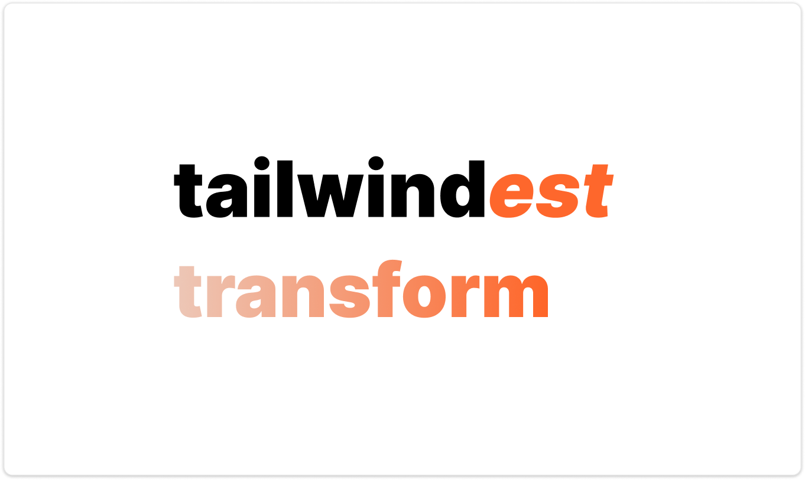

# tailwindest-css-transform

<div align="center">

</div>

Automate your migration from standard Tailwind CSS to type-safe **Tailwindest** objects.

## Features

- **Zero-Config Migration**: Automatically detects your `tailwindest` setup (namespace, paths) from your project.
- **Smart Auto-Import**: Inserts necessary import statements into transformed files automatically.
- **Source-Safe**: Uses AST (Abstract Syntax Tree) traversal to ensure code logic remains untouched.
- **Type-Safe**: Generates objects that are 100% compatible with `tailwindest` types.
- **Typeset-Aware Resolution**: Emits only actual generated Tailwindest record
  keys. Utility classification is checked against the generated `Tailwind`
  interface, with Tailwind compiler CSS used only to disambiguate semantics.
- **Lossless Static Token Preservation**: Keeps Tailwind selector anchors,
  arbitrary declarations, plugin utilities, and unresolved static tokens in the
  generated class stream.
- **Registry-Hardened**: Validated against shadcn registry fixtures with merge
  stability and output token-preservation specs.

## Installation

```bash
# Run directly with npx
npx tailwindest-css-transform <target> [options]

# Or install globally
npm install -g tailwindest-css-transform
```

## Usage

```bash
# Transform a single file
npx tailwindest-css-transform src/components/Button.tsx

# Transform an entire directory recursively
npx tailwindest-css-transform src/pages

# Preview changes without modifying files
npx tailwindest-css-transform src --dry-run

# Override auto-discovered config when needed
npx tailwindest-css-transform src \
    --css src/styles/tailwind.css \
    --identifier tw \
    --module @/styles/tailwind \
    --mode runtime
```

Running `npx tailwindest-css-transform` without a target opens an interactive
prompt that asks only for the file or directory to transform. The CLI then
detects the Tailwind CSS entry, Tailwindest `createTools` export, import path,
mode, walkers, and dry-run setting.

## CLI Options

| Option                | Alias | Default        | Description                                     |
| :-------------------- | :---- | :------------- | :---------------------------------------------- |
| `--css <path>`        | `-c`  | auto-detected  | Tailwind CSS entry used to initialize Tailwind. |
| `--identifier <name>` | `-i`  | auto or `tw`   | Tailwindest import identifier.                  |
| `--module <path>`     | `-m`  | auto or `~/tw` | Tailwindest module import path.                 |
| `--dry-run`           | `-d`  | `false`        | Preview changes without modifying files.        |
| `--mode <mode>`       | -     | `auto`         | Output mode: `auto` or `runtime`.               |
| `--help`              | `-h`  | -              | Display help for command.                       |

Auto discovery uses the same Tailwind CSS root and Tailwind package resolution
helpers as `create-tailwind-type`. If a local Tailwind package is older than v4,
the CLI warns and falls back to the internal Tailwind v4 engine.

## Example

**Before:**

```tsx
const className =
    "flex items-center justify-center p-4 bg-blue-500 hover:bg-blue-600 text-white rounded-lg transition-colors"
```

**After:**

```tsx
const style = tw.style({
    display: "flex",
    alignItems: "items-center",
    justifyContent: "justify-center",
    padding: "p-4",
    backgroundColor: "bg-blue-500",
    hover: {
        backgroundColor: "hover:bg-blue-600",
    },
    color: "text-white",
    borderRadius: "rounded-lg",
    transitionProperty: "transition-colors",
})
```

### Preserved raw tokens

Some Tailwind tokens are not direct CSS properties but are still required for
selectors, variants, animations, or CSS-variable recipes. The transformer
preserves these tokens with `tw.def(...)` or raw `tw.join(...)`.

**Before:**

```tsx
const value = cn(
    "peer/menu-button flex text-sm hover:bg-sidebar-accent",
    className
)
```

**After:**

```tsx
const menuButton = tw.style({
    display: "flex",
    fontSize: "text-sm",
    hover: {
        backgroundColor: "hover:bg-sidebar-accent",
    },
})

const value = tw.join(
    tw.def(["peer/menu-button"], menuButton.style()),
    className
)
```

This preservation path covers token families such as:

- named group and peer anchors: `group/card`, `peer/menu-button`
- named container anchors: `@container/card-header`
- arbitrary declarations: `[--card-spacing:--spacing(5)]`
- variant arbitrary declarations:
  `data-[size=sm]:[--card-spacing:--spacing(4)]`
- placement animation utilities:
  `data-[side=bottom]:slide-in-from-top-2`
- descendant variant chains such as `**:data-[slot=kbd]:z-50`
- parenthesized arbitrary value utilities when the active generated typeset
  cannot represent their variant key, such as `xs:w-(--popup-width)` in a
  project whose generated `TailwindNestGroups` does not include `xs`

### Typeset-aware record keys

The transformer does not emit object keys from CSS declaration names. It asks
`create-tailwind-type` to resolve utilities against the actual generated
`Tailwind` interface used by Tailwindest.

```tsx
// Source
className = "group-has-[[data-sidebar=menu-action]]/menu-item:pr-8"

// Output
tw.style({
    "group-has-[[data-sidebar=menu-action]]/menu-item": {
        padding: "group-has-[[data-sidebar=menu-action]]/menu-item:pr-8",
    },
})
```

This is intentionally `padding`, not `paddingRight`, when the generated
Tailwindest typeset exposes `pr-*` under the `padding` record key. The shadcn
registry typecheck gate runs generated output against the real
`tailwind.2.ts`-style typeset so stale mock type definitions cannot hide
invalid object keys.

### CVA migration

`cva(...)` declarations are rewritten to the matching Tailwindest styler API.
Static variant maps become `tw.variants(...)`, `VariantProps` becomes
`GetVariants`, and call sites use `.class(...)` so they match the
`createTools` signatures.

**Before:**

```tsx
import { cva, type VariantProps } from "class-variance-authority"
import { cn } from "@/lib/utils"

const buttonVariants = cva("inline-flex items-center", {
    variants: {
        variant: {
            default: "bg-primary text-primary-foreground",
            outline: "border bg-background",
        },
        size: {
            default: "h-9 px-4",
            sm: "h-8 px-3",
        },
    },
})

interface ButtonProps extends VariantProps<typeof buttonVariants> {
    className?: string
}

function Button({ className, variant, size }: ButtonProps) {
    return (
        <button className={cn(buttonVariants({ variant, size, className }))} />
    )
}
```

**After:**

```tsx
import { tw } from "~/tw"
import { type GetVariants } from "tailwindest"

const buttonVariants = tw.variants({
    base: {
        display: "inline-flex",
        alignItems: "items-center",
    },
    variants: {
        variant: {
            default: {
                backgroundColor: "bg-primary",
                color: "text-primary-foreground",
            },
            outline: {
                borderWidth: "border",
                backgroundColor: "bg-background",
            },
        },
        size: {
            default: {
                height: "h-9",
                padding: "px-4",
            },
            sm: {
                height: "h-8",
                padding: "px-3",
            },
        },
    },
})

interface ButtonProps extends GetVariants<typeof buttonVariants> {
    className?: string
}

function Button({ className, variant, size }: ButtonProps) {
    return (
        <button
            className={tw.join(
                buttonVariants.class({ variant, size }),
                className
            )}
        />
    )
}
```

When a `cva(...)` declaration has no variant map, it is emitted as `tw.style(...)`
and call sites use `.class(...)`.

When a `cva(...)` declaration contains preserved tokens, call sites use
`tw.def(..., helper.style(...))`. Base preserved tokens are unconditional;
variant-option preserved tokens are conditional on the selected option:

```tsx
const value = tw.join(
    tw.def(
        [
            "peer/menu-button",
            variant === "outline" && "hover:bg-sidebar-accent",
        ],
        sidebarMenuButtonVariants.style({ variant })
    ),
    className
)
```

If a call site does not expose a safe selected variant value, the transformer
does not guess. It emits a diagnostic instead of unconditionally applying a
variant-specific token.

## Preservation Model

The transformer first builds a lossless plan for each supported static class
source:

- structured tokens: resolver-backed utilities emitted into Tailwindest style
  objects
- preserved tokens: unresolved or non-property tokens emitted as class literals

Every supported static input token must be represented in the generated output.
Exact class order is not treated as a universal guarantee, but dynamic/user
class arguments keep their later precedence, and static-after-dynamic
`cn(...)` shapes are not pooled across dynamic arguments.

The shadcn registry test suite enforces this with:

- `twMerge(source) === source` stability checks for every collected static
  source
- transformed-output multiset checks that every input token is present
- generated `.tsx` typechecks against the actual Tailwindest generated
  `Tailwind` record key surface
- targeted historical assertions for group, peer, container, arbitrary
  declaration, animation, descendant-chain, and parenthesized arbitrary-value
  families

---

For more details, visit our [official documentation](https://tailwindest.vercel.app/css-transformer).
