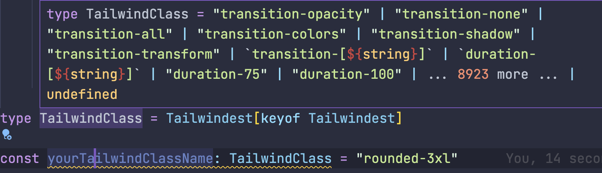

import { Callout } from "nextra-theme-docs"
import { Underline } from "~components/common"

# Design goals

## 1. <Underline>Fully-typed</Underline>

To make <Underline>fully-typed</Underline> `tailwind`, first define all the base classname properties in `tailwind` docs.

Then, using the power of `typescript`'s **`string literal` and `generic` magics🔮**.

### ex) Get All Tailwind Classname

The Final result shows fully typed product, but near zero bundle size.
**Because it is just type definitions.**

```ts
type TailwindClass = Tailwindest[keyof Tailwindest]
```



### ex) Access Infinite Nested Break Conditions

`Typescript`'s recursive type computation allows you to write infinite Nested Break conditions.

```ts
const infinite = wind({
    "::after": {
        "::before": {
            "::file": {
                "::first-letter": {
                    "::first-line": {
                        "::marker": {
                            "::placeholder": {
                                "::selection": {
                                    ":active": {
                                        ":autofill": {
                                            backgroundColor:
                                                "after:before:file:first-letter:first-line:marker:placeholder:selection:active:autofill:bg-amber-100",
                                        },
                                    },
                                },
                            },
                        },
                    },
                },
            },
        },
    },
})
```

---

## <Underline>Readable</Underline>

Readability is core goal of this project.
To achieve this, design an **<Underline>intuitive</Underline>, <Underline>primitive</Underline>, <Underline>familiar</Underline> API** is essential process.

Final conclusion is going back to the most primitive form, as if we were writing down pure `CSS`. And this led to the conclusion that the CSS in JS form is the best fit.

<Callout type="info">
    Most of the `tailwindcss` **properties name is based on pure `CSS`
    properties,** except `tailwind`'s sole utility properties like `mx-1`.
</Callout>

### Just like `CSS in JS`

```ts
const box = wind({
    display: "flex",
    flexDirection: "flex-row",
    alignItems: "items-center",
    justifyContent: "justify-center",

    gap: "gap-2",

    marginX: "mx-2",
})
```

At this point, you may feel **this is breaking core benefits like fast writing and building products**.
But don't worry. **Because `key` & `value` is all autocompleted** by `typescript`'s magic🔮.

**Writing speed is not a problem**.

### Colocate `nest` conditions

In pure `tailwind`, you should write nest conditions like this.

```ts
const smConditions =
    "sm:flex sm:items-center sm:justify-center sm:p-2 sm:m-2 sm:border sm:rounded-sm"
```

As you can see, the `sm:` expression is repeated. But with `tailwindest`, you can colocate nest conditions in one `object`.

```ts
const easyToRead = wind({
    "@sm": {
        display: "sm:flex",
        alignItems: "sm:items-center",
        justifyContent: "sm:justify-center",

        padding: "sm:p-2",
        margin: "sm:m-2",

        borderWidth: "sm:border",
        borderRadius: "sm:rounded-sm",
    },
})
```

<Callout>
    You don't have to type nest conditions by manually. It is autocompleted.

    So, If you want add nest styles, just **type part of normal tailwind property**.

    ```ts
    wind({
        '@dark': {
            ':hover': {
                // Just type red3 -> then, all thing is autocompleted.
                backgroundColor: 'red3 -> dark:hover:bg-red-300';
            }
        }
    })
    ```

</Callout>

---

## <Underline>Reusable</Underline>

Unlike `CSS in JS` libraries, `tailwindest` **only handles `strings`**. That means, you can reuse all the elements you write.

### Reuse all elements

```ts
const box = wind({
    display: "flex",
    flexDirection: "flex-row",
    alignItems: "items-center",
    justifyContent: "justify-center",
    gap: "gap-2",
})
```

Final API design is like this, so now we can use two information in the style definition.

1. <Underline>stylesheet</Underline> : **`object`** (`wind` _argument_)
2. <Underline>classname</Underline> : **`string`** (values of stylesheet)

Let's get `classname` **`string`** by `.class` method

```ts
const boxClass = box.class()
// flex flex-row items-center justify-center gap-2
```

And extract `stylesheet` **`object`** by `.style` method

```ts
const boxStyle = box.style()
/**
{
    display: "flex",
    flexDirection: "flex-row",
    alignItems: "items-center",
    justifyContent: "justify-center",
    gap: "gap-2",
}
**/
```

<Callout type="info">
    `classname` and `stylesheet` are **just `string` and `object`.**
</Callout>

**So you can reuse all the elements that you want to.**

## It's time to dive! 🏄

Now, you are ready to dive in. Let's get into it!
