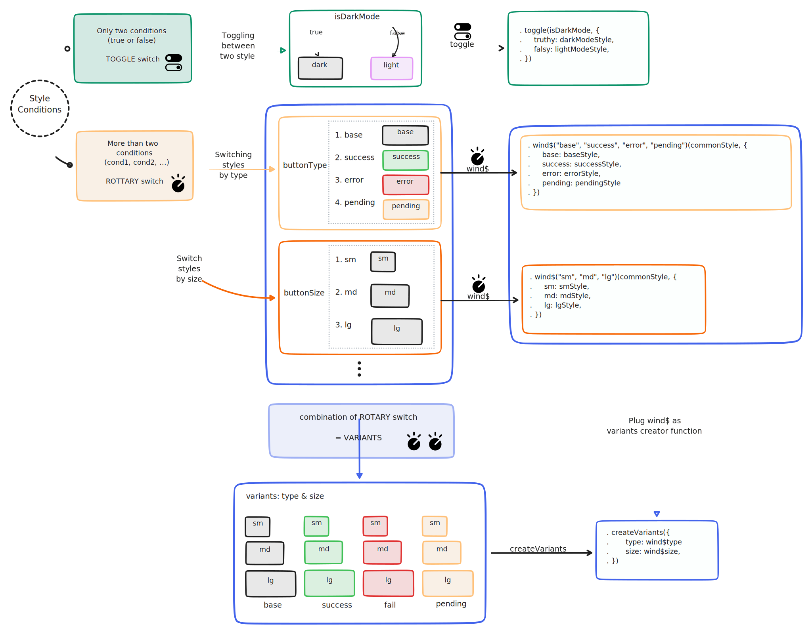
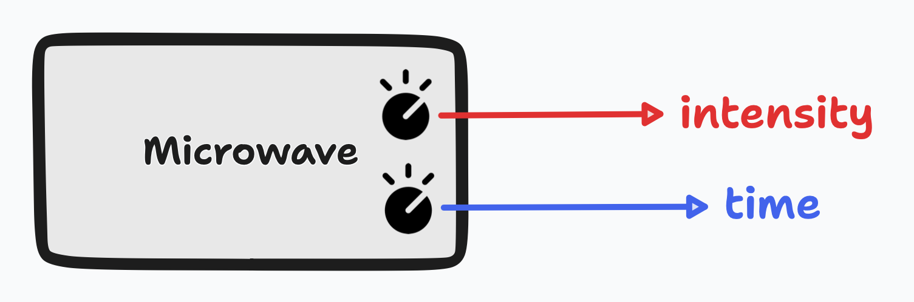
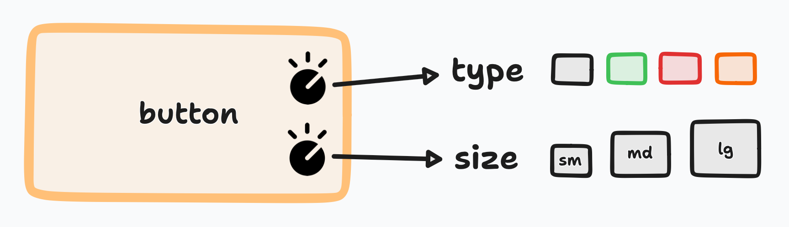

import { Callout } from "nextra-theme-docs"
import { Underline } from "~components/common"

# Introduction

<br />

<div
    align="center"
    className="animate-appear select-none"
>
    

</div>

## Classname generator

Unlike other css in js frameworks, `tailwindest` is just **`className` generator function** like `clsx`, but optimized only for `tailwindcss`.
And the fact that `tailwindest` is a `string` generator gives it the following advantages.

1. **Tiny bundle size, `637B`**
2. **Independency of framework & environment**
3. **Zero build step**

## Design philosophies for conditional styling

### Core concept

The easiest way to understand conditional styling is to **think of switches**.
We're surrounded by them all the time: we turn lights on and off, and our beloved keyboards are all switches. **Conditional styling can also be thought of as a type of switch** (albeit a physical one).



### Toggle switch

The simplest switch is a `toggle`, which can only express two states: on/off. Let's use this concept in programming.
You need to create a button that supports dark/light mode, i.e and **its style should change depending on the value of a boolean variable called `isDarkMode`**.
It's like a light switch: pressing it (on = `true`) turns it on (light mode), pressing the other side (off = `false`) turns it off (dark mode).

```tsx {1-5}
const ThemeBtn = ({ children }) => {
    const [isDarkMode, setIsDarkMode] = useState(false)
    return (
        <button
            className={toggle(isDarkMode, {
                truthy: truthyStyle,
                falsy: falsyStyle,
                base: baseStyle /* Optional */,
            })}
        >
            {children}
        </button>
    )
}
```

### Rotary switch

But in the real world, we can't express everything with a toggle switch, so we need to create a switch that's a step more complex: a rotary switch. If you've ever used a microwave oven, it's easy to understand! From steps 1, 2 to 10, we can fine-tune the time and intensity we want with a ROTARY switch.
So, for example, if we want to present a UI with 4 states: `"base"`, `"success"`, `"failure"` and `"pending"`, we can import the concept of a rotary switch: if it's `"success"`, we can associate a style for success, if it's `"failure"`, we can associate a style for failure, and so on.

```tsx {1-12}
const btn = wind$(
    /* 🔮 Rotary conditions */
    "base",
    "success",
    "failure",
    "pending"
)(commonBtnStyle, {
    base: baseBtnStyle,
    success: successBtnStyle,
    failure: failureBtnStyle,
    pending: pendingBtnStyle,
})

const Btn = ({
    children,
    type = "base",
}: {
    children: ReactNode
    type: WindVariants<typeof btn>
}) => <button className={btn.class(type)}>{children}</button>
```

### Combination of rotary, variants

However, there may be times when we need a few more states. In other words, we may need to **create multiple rotary switches** to represent more complex states.
This is where the `variants` comes in.

`variants` are **combinations of rotary switches** - think of the **microwave at home**. You'll notice that it has a few rotary switches, such as **time** and an **intensity**.

<div className="w-full md:w-2/3 mt-4"></div>

Similarly, with variants, you first create a category of switches for each of the criteria you need to adjust, and then add them to your Style functions.

<div className="w-full md:w-2/3 mt-4"></div>

1. `type` **rotary switch**

```tsx /wind$/ {2-5}
const buttonType = wind$(
    "base",
    "success",
    "failure",
    "pending"
)(commonBtnStyle, {
    base: baseBtnStyle,
    success: successBtnStyle,
    failure: failureBtnStyle,
    pending: pendingBtnStyle,
})
```

2. `size` **rotary switch**

```tsx /wind$/ {2-4}
const buttonSize = wind$(
    "sm",
    "md",
    "lg"
)(sizeCommonStyle, {
    sm: smSizeStyle,
    md: mdSizeStyle,
    lg: lgSizeStyle,
})
```

3. combination of rotary, `variants`

```tsx /createVariants/ {2-3}
const btn = createVariants({
    type: buttonType,
    size: buttonSize,
})
```

4. add style at component

```tsx /className/
interface BtnProps extends WindVariants<typeof btn> {
    children: ReactNode
}

const Btn = ({ children, type = "default", size = "md" }) => (
    <button
        className={btn({
            type,
            size,
        })}
    >
        {children}
    </button>
)
```

## Pros and cons

### Pros

1. Insure <Underline>Type-safe</Underline>

2. Increase <Underline>Readability</Underline>

3. Increase <Underline>Reusability</Underline>

4. Increase <Underline>Maintainability</Underline>

### Cons

1. Takes **longer to write**

2. **Verbose than original** `tailwind`

### Conclusion

The great thing about `tailwind` is that **it makes it quick and easy to get your product** done. But it introduces new problems: **readability** and **maintainability**.
In contrast, `tailwindest` can't get your product done any faster than regular `tailwind`. It **specializes in designing products that are easy to refactor and robust style**.

Now just combine the best of both worlds

<Callout>
    if your `className` is too long to maintain, write it with `tailwindest`,
    but if it's short and easy to read, write an inline `className`.
</Callout>

If you apply `tailwindest` in the right circumstances, you can build a much more robust product with `tailwind`.

## Real world adaptation

1. **Short `className`**: `inline-class`
2. **Complex & Reusable `className`**: `tailwindest`

<Callout type="info">
    The code below is the `Card` component **in the Feature on the main page**.
</Callout>

### Original

```tsx {14, 16, 20}
export const Card = ({
    onClick,
    children,
    icon,
}: {
    onClick: () => void
    icon: ReactNode
    children: ReactNode
}) => {
    return (
        <button
            type="button"
            onClick={onClick}
            className="flex flex-col items-start justify-between gap-2 p-2 hover:translate-y-[1.5px] hover:border-transparent hover:opacity-100 active:border-amber-400/10 active:opacity-75 transition-all ease-in duration-75 select-none sm:flex-row sm:items-center sm:p-2.5 bg-amber-600/10 rounded border-amber-400/20 border"
        >
            <div className="w-6 h-6 min-w-[1.5rem] min-h-[1.5rem] p-1 bg-gradient-to-bl from-amber-700/30 to-amber-700/50 border-amber-400 border rounded md:w-7 md:h-7 md:min-w-[1.75rem] md:min-h-[1.75rem] md:p-1.5">
                {icon}
            </div>

            <div className="font-bold text-sm md:text-base md:font-semibold text-start">
                {children}
            </div>
        </button>
    )
}
```

### Build with tailwindest

```tsx /wind/ /className/
import { wind } from "wind"

// 💡 Reusable className
export const cardContainer = wind({
    backgroundColor: "bg-amber-600/10",

    borderRadius: "rounded",
    borderColor: "border-amber-400/20",
    borderWidth: "border",
})

// 💡 Long className
const card = wind({
    display: "flex",
    flexDirection: "flex-col",
    alignItems: "items-start",
    justifyContent: "justify-between",
    gap: "gap-2",

    padding: "p-2",

    ":hover": {
        transformTranslateY: "hover:translate-y-[1.5px]",
        borderColor: "hover:border-transparent",
        opacity: "hover:opacity-100",
    },
    ":active": {
        borderColor: "active:border-amber-400/10",
        opacity: "active:opacity-75",
    },
    transition: "transition-all ease-in",
    transitionDuration: "duration-75",
    userSelect: "select-none",

    "@sm": {
        flexDirection: "sm:flex-row",
        alignItems: "sm:items-center",
        padding: "sm:p-2.5",
    },
})
    .compose(cardContainer.style())
    .class()

// 💡 Long className
const cardIcon = wind({
    width: "w-6",
    height: "h-6",
    minWidth: "min-w-[1.5rem]",
    minHeight: "min-h-[1.5rem]",

    padding: "p-1",

    backgroundImage: "bg-gradient-to-bl",
    backgroundImageGradientStart: "from-amber-700/30",
    backgroundImageGradientEnd: "to-amber-700/50",

    borderColor: "border-amber-400",
    borderWidth: "border",
    borderRadius: "rounded",

    "@md": {
        width: "md:w-7",
        height: "md:h-7",
        minWidth: "md:min-w-[1.75rem]",
        minHeight: "md:min-h-[1.75rem]",

        padding: "md:p-1.5",
    },
}).class()

export const Card = ({
    onClick,
    children,
    icon,
}: {
    onClick: () => void
    icon: ReactNode
    children: ReactNode
}) => {
    return (
        <button type="button" onClick={onClick} className={card}>
            <div className={cardIcon}>{icon}</div>
            {/* ⚡️ Short and don't have to reuse it */}
            <div className="font-bold text-sm md:text-base md:font-semibold text-start">
                {children}
            </div>
        </button>
    )
}
```

## How needs it?

### Recommended

1. Use `tailwind` for creating a design system
2. Want to add type-safety to `tailwind`
3. Start projects where maintainability is important
4. People who wants great conditional styling DX

### Not recommended

1. Need to make a product and ship it quickly
2. Don't need type-safety
3. Fine with `clsx`
