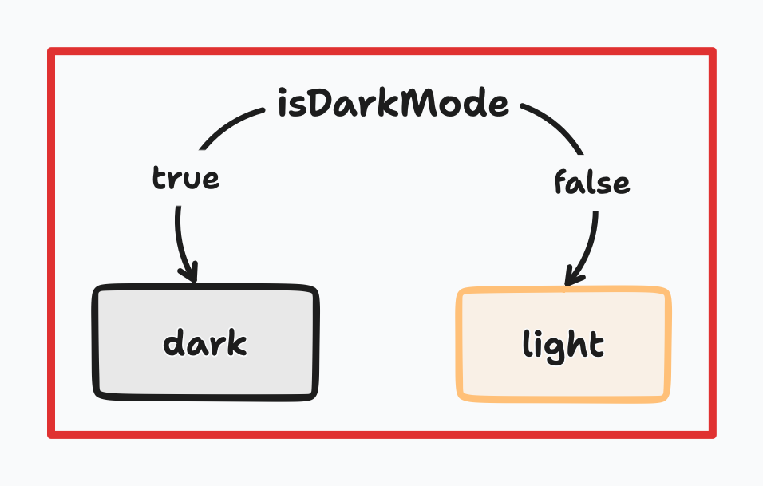
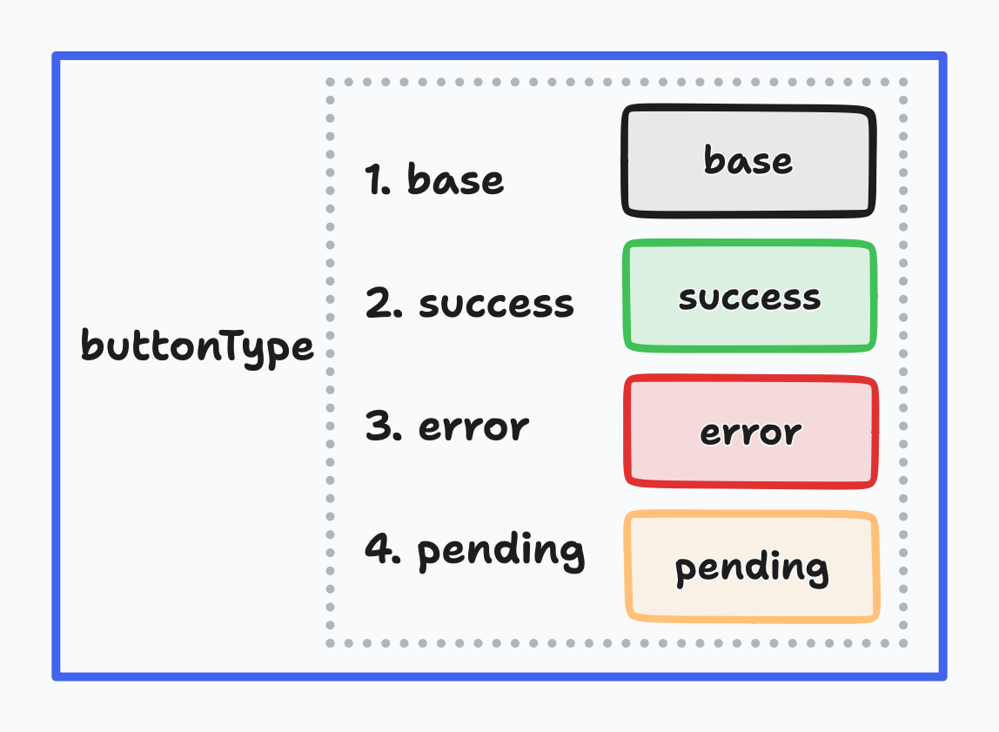
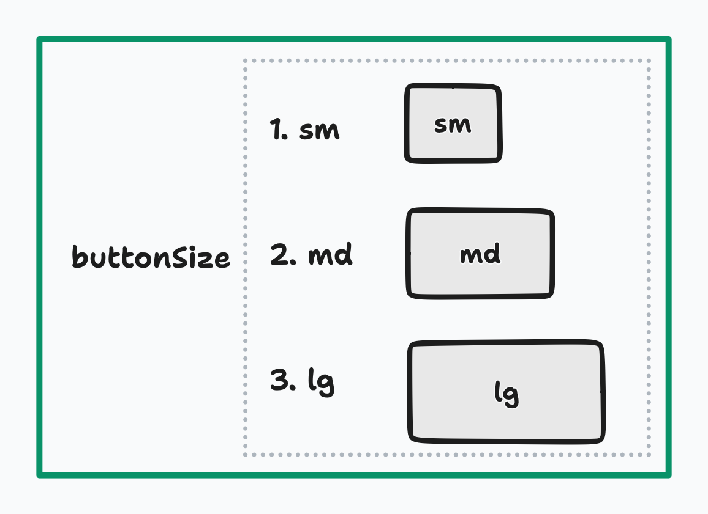

import { Callout } from "nextra-theme-docs"

# Conditional styling

Use `toggle`, `wind$`, `createVariants` functions for easy conditional styling.

1. `toggle`: change the style by a `boolean` condition
2. `wind$`: change the style by some conditions
3. `createVariants`: complex combination of conditions

<Callout>
    Checkout [design
    philosophies](../1_start/introduction#design-philosophies-for-conditional-styling)
    for conditional styling.
</Callout>

## Toggle switch - `toggle`

The `toggle` function is used to **change the style** by a **single `boolean` condition**. You should define a style for each of the `true` and `false` conditions and optionally define a common style for `true` and `false` conditions.

### Mind concept

<br />
<div className="w-full md:w-2/3">
    
</div>

### Implementation - `toggle`

```tsx
const ThemeBtn = () => {
    const [isDarkMode, setIsDarkMode] = useState(false)

    return (
        <button
            className={toggle(isDarkMode, {
                base: {
                    display: "flex",
                    alignItems: "items-center",
                    justifyContent: "justify-center",
                    padding: "p-2",
                    "@lg": {
                        padding: "lg:p-3",
                    },
                    borderRadius: "rounded",
                    borderWidth: "border",
                },
                truthy: {
                    backgroundColor: "bg-black",
                    borderColor: "border-white",
                    color: "text-white",
                },
                falsy: {
                    backgroundColor: "bg-white",
                    borderColor: "border-black",
                    color: "text-black",
                },
            })}
        >
            {isDarkMode ? "light" : "dark"}
        </button>
    )
}
```

## Rotary switch - `wind$`

### Mind concept - `type`

<br />
<div className="w-full md:w-2/3">
    
</div>

### Implementation

Define button `type`, `"default" | "success" | "failed" | "pending"`

```tsx {2-5}
const buttonType = wind$(
    "default",
    "success",
    "failed",
    "pending"
)(
    {
        // define common style for button type
        display: "flex",
        alignItems: "items-center",
        justifyContent: "justify-center",

        padding: "p-2",
        borderWidth: "border",
        borderRadius: "rounded",

        color: "text-black",
        "@dark": {
            color: "dark:text-white",
        },

        ":hover": {
            opacity: "hover:opacity-90",
        },
        ":active": {
            opacity: "active:opacity-75",
            transformTranslateY: "active:-translate-y-0.5",
        },
    },
    {
        default: {
            borderColor: "border-neutral-100",
            backgroundColor: "bg-white",
        },
        failed: {
            borderColor: "border-red-400",
            backgroundColor: "bg-red-400/50",
        },
        pending: {
            borderColor: "border-yellow-400",
            backgroundColor: "bg-yellow-400/50",
        },
        success: {
            borderColor: "border-green-400",
            backgroundColor: "bg-green-400/50",
        },
        defaultVariant: "default",
    }
)

const Button = ({
    children,
    onClick,
    type = "default",
}: React.PropsWithChildren<{
    type?: WindVariants<typeof buttonType>
    onClick: () => void
}>) => {
    return (
        <button onClick={onClick} className={buttonType.class(type)}>
            {children}
        </button>
    )
}
```

<Callout>What is [`defaultVariant`](../5_apis/wind$#)?</Callout>

### Usage

```tsx
const SomeComponent = () => {
    const [emailTo, setEmailTo] = useState<string | null>(null)

    return (
        <div>
            <Input />
            <Button
                type="pending"
                onClick={async () => {
                    await sendEmail(emailTo)
                }}
            >
                Send email
            </Button>
        </div>
    )
}
```

### Mind concept - `size`

<br />
<div className="w-full md:w-2/3">
    
</div>

### Implementation

Define button `size`, `"sm" | "md" | "lg"`

```ts {2-4}
const buttonSize = wind$(
    "sm",
    "md",
    "lg"
)(
    {
        // define common style for button size
        fontWeight: "font-medium",
        fontFamily: "font-serif",
    },
    {
        sm: {
            padding: "p-0.5",
            borderRadius: "rounded-sm",
            fontSize: "text-sm",
        },
        md: {
            padding: "p-1.5",
            borderRadius: "rounded",
            fontSize: "text-base",
        },
        lg: {
            padding: "p-2.5",
            borderRadius: "rounded-lg",
            fontSize: "text-lg",
        },
        defaultVariant: "md",
    }
)
```

## Combination of rotary switch - `createVariants`

### Mind concept - `type` & `size`


### Implementation

Define complex variants with `createVariants`

```tsx {2-3}
const button = createVariants({
    type: buttonType,
    size: buttonSize,
})

interface ButtonProps extends WindVariants<typeof button> {
    children: ReactNode
    onClick: () => void
}

const Button = ({
    children,
    onClick,
    size = "md",
    type = "default",
}): ButtonProps => {
    return (
        <button
            onClick={onClick}
            className={button({
                type,
                size,
            })}
        >
            {children}
        </button>
    )
}
```

### Usage

```tsx
const SomeComponent = () => {
    return (
        <div>
            <Button size="lg" type="success" onClick={welcome}>
                Succeeded
            </Button>
        </div>
    )
}
```
